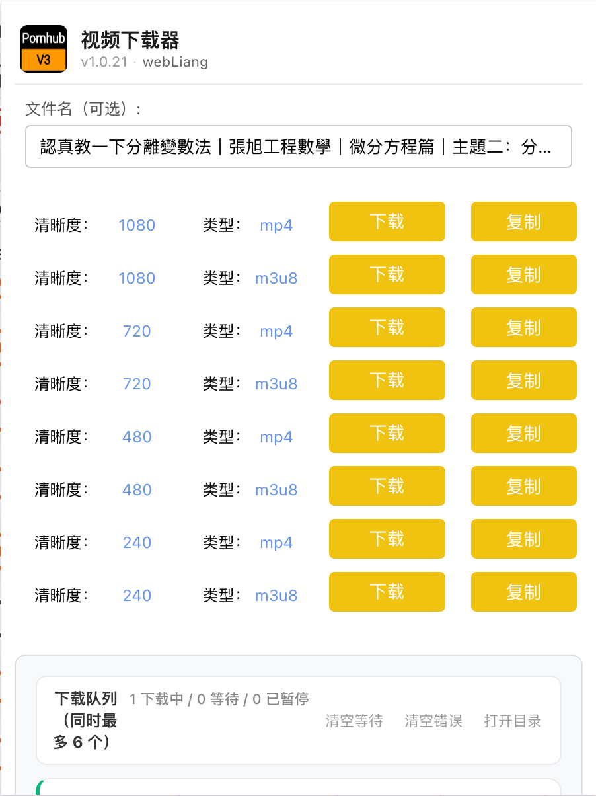
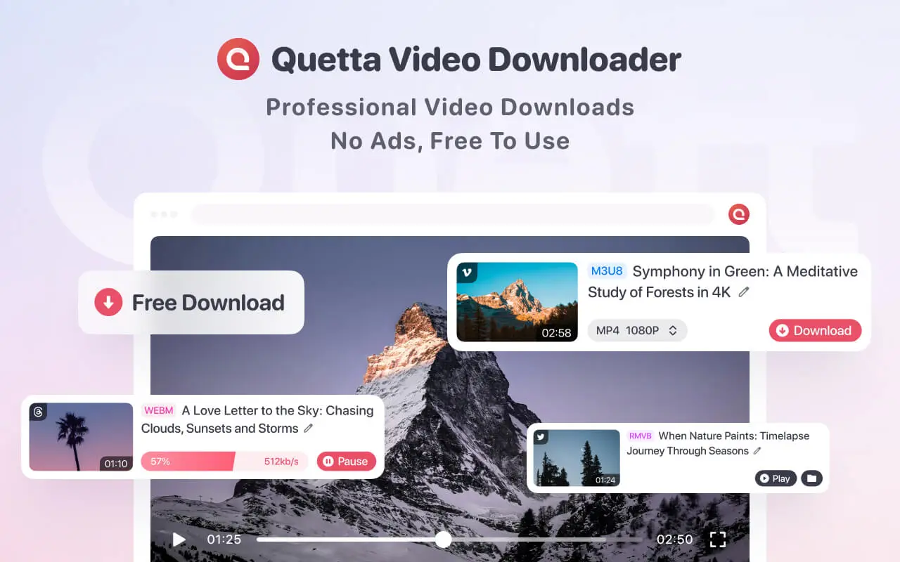
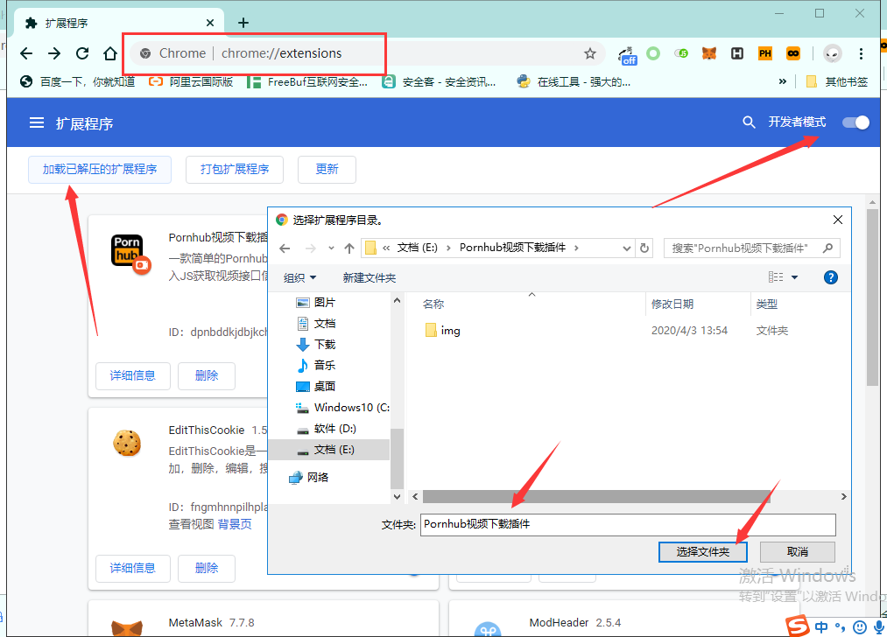

# Pornhub Video Downloader — मल्टी-रेज़ोल्यूशन डाउनलोड

**भाषाएँ / Languages**

- **中文**：[README.zh_CN.md](README.zh_CN.md)
- **English**：[README.md](README.md)
- **Español**：[README.es.md](README.es.md)
- **हिन्दी**（वर्तमान）：[README.hi.md](README.hi.md)
- **العربية**：[README.ar.md](README.ar.md)

Chrome एक्सटेंशन जो Pornhub और अन्य समर्थित साइटों पर **मल्टी-रेज़ोल्यूशन** में वीडियो डाउनलोड करने देता है। यह रिपॉज़िटरी इसलिए मेंटेन की जा रही है क्योंकि [मूल प्रोजेक्ट](https://github.com/zgao264/Pornhub-Video-Downloader-Plugin) लंबे समय से अपडेट नहीं है और Manifest V2 डिप्रिकेट हो रहा है।

<table width="100%">
  <tr>
    <td align="center">
       
      <strong>⚡️ इस Chrome एक्सटेंशन टेम्पलेट से बना है</strong>
      <h1><a href="https://github.com/webLiang/chrome-extension-boilerplate-react-vite">Vite 8</a></h1>
      
<strong>React + TypeScript · Manifest V3 · तेज़ बिल्ड</strong>

      

        
        
        
        
      

      

        यह एक्सटेंशन <a href="https://github.com/webLiang/chrome-extension-boilerplate-react-vite"><strong>chrome-extension-boilerplate-react-vite</strong></a> पर विकसित है। 
        <strong>Vite 8 + Rolldown</strong> — प्रोडक्शन बिल्ड आमतौर पर <strong>~100–300ms</strong> में पूरा होता है। 
        📖 <a href="https://github.com/webLiang/chrome-extension-boilerplate-react-vite#intro">टेम्पलेट डॉक्स</a> ·
        <a href="https://github.com/webLiang/chrome-extension-boilerplate-react-vite#why-this-template">स्पीड नोट्स</a> ·
        <a href="https://github.com/webLiang/chrome-extension-boilerplate-react-vite#screenshots">स्क्रीनशॉट</a> ·
        <a href="https://github.com/vitejs/awesome-vite">Awesome Vite</a>
      

      

        
      

      
टेम्पलेट पर <strong>Stars</strong> और <strong>Merge Requests</strong> का स्वागत है।

       
    </td>
  </tr>
</table>

---

## 1. मल्टी-रेज़ोल्यूशन डाउनलोड + स्क्रीनशॉट

- समर्थित साइटों पर **कई क्वालिटी** (जैसे 720p, 1080p) चुनकर डाउनलोड कर सकते हैं।
- एक्सटेंशन वीडियो पेज में JS inject करके वास्तविक stream URL निकालता है और डाउनलोड लिंक बनाता है।

  

---

## 2. मोबाइल पर एक्सटेंशन सपोर्ट करने वाले ब्राउज़र (महत्वपूर्ण)

मोबाइल/टैबलेट पर उपयोग के लिए ऐसा ब्राउज़र चाहिए जो एक्सटेंशन इंस्टॉल करने दे। अनुशंसित:

| प्लेटफ़ॉर्म | अनुशंसा |
|-----------|---------|
| **मोबाइल** | **[Quetta](https://www.quetta.net/)** — Chrome एक्सटेंशन सपोर्ट और बिल्ट-इन वीडियो क्षमता |

> **मोबाइल URL (बुकमार्क करें):** **https://www.quetta.net/**  
> **PC वीडियो डाउनलोडर एक्सटेंशन:** **https://www.quetta.net/products/pcextension**

  

Quetta एक आधिकारिक मल्टी-प्लेटफ़ॉर्म वीडियो डाउनलोडर एक्सटेंशन भी देता है — **YouTube · Twitter/X · Facebook · Bilibili · TikTok · Instagram · Vimeo** आदि पर काम करता है, और इस प्लगइन का डेस्कटॉप पर बढ़िया साथी है।

  

---

## डाउनलोड और इंस्टॉल

- **ZIP डाउनलोड:** [Releases — Pornhub-Video-Downloader-Plugin.zip](https://github.com/webLiang/Pornhub-Video-Downloader-Plugin-v3/releases)

### Chrome

1. `chrome://extensions/` खोलें
2. **Developer mode** ऑन करें
3. **Load unpacked** पर क्लिक करें और एक्सट्रैक्ट किए हुए फ़ोल्डर को चुनें

  

### अन्य Chromium ब्राउज़र (जैसे 360)

- **.crx** डाउनलोड करके ब्राउज़र में ड्रैग करके इंस्टॉल करें।

---

## समर्थित साइटें

| साइटें |
|------|
| pornhub.com |
| xvideos.com |
| xnxx.com · xnxx.es |
| xvv1deos.com |
| xhamster.com · xhamster42.desi · xhamster1.desi |
| redtube.com |
| missav.ws · missav.live · missav.com |
| 123av.com |

---

## अपडेट रिकॉर्ड

| वर्ज़न | नोट्स |
|------|------|
| v1.0.3 | xnxx.com सपोर्ट |
| v1.0.4 | xhamster.com सपोर्ट |
| v1.0.5 | xvideos/xnxx के लिए 1080p और m3u8, UI सुधार |
| v1.0.7 | अन्य साइटों पर popup error होने पर remote version गलत दिखने की समस्या ठीक |
| v1.0.8 | ऑटोमेटेड crx build |
| v1.0.9 | redtube.com सपोर्ट |
| v1.0.10 | मल्टी-डोमेन: xvv1deos.com, xnxx.es, xhamster42.desi, xhamster1.desi |
| v1.0.11 | डाउनलोड फ़ाइल नाम सुधार |
| v1.0.12 | PC साइट पर फ़ाइल नाम सुधार |
| v1.0.15 | xvideos.com नियम सुधार |
| v1.2.0 | missav.ws / missav.live / 123av.com HLS डाउनलोड |
| todo | प्लान्ड सपोर्ट: [spankbang.com](https://spankbang.com/) |

---

## Star History

<a href="https://star-history.dera.page/#webLiang/Pornhub-Video-Downloader-Plugin-v3&Date">
  <picture>
    <source media="(prefers-color-scheme: dark)" srcset="https://star-history.dera.page/svg?repos=webLiang/Pornhub-Video-Downloader-Plugin-v3&type=Date&theme=dark" />
    <source media="(prefers-color-scheme: light)" srcset="https://star-history.dera.page/svg?repos=webLiang/Pornhub-Video-Downloader-Plugin-v3&type=Date" />
    
  </picture>
</a>

---

## और Chrome एक्सटेंशन

इसी लेखक के अन्य ओपन-सोर्स टूल:

| एक्सटेंशन | विवरण |
|-----------|------|
| [DevTools Unlock](https://github.com/webLiang/devtools-unlock) | डिबगिंग ब्लॉक करने वाली साइटों पर DevTools वापस चालू करें (जैसे disable-devtool)। |
| [Header Modify](https://github.com/webLiang/header-modify-extention) | मौजूदा साइट के रिक्वेस्ट हेडर बदलें, iframes सहित। |

